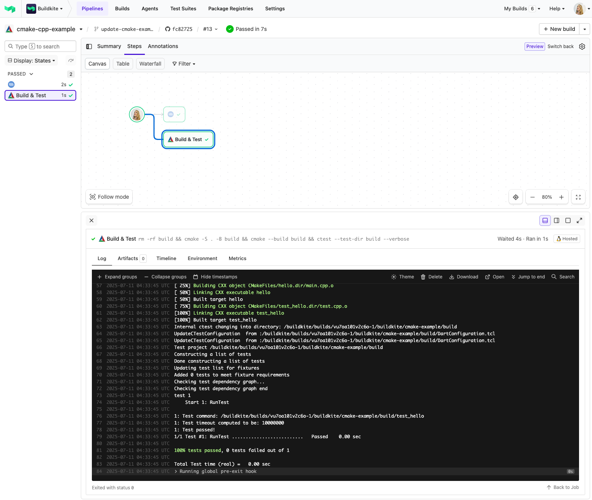

# Buildkite CMake C++ Example

This repository is an example [Buildkite](https://buildkite.com/) pipeline for building and testing a C++ project using [CMake](https://cmake.org/).

👉 **See this example in action:** [buildkite/cmake-cpp-example](https://buildkite.com/buildkite/cmake-cpp-example/builds/latest?brnach=main)

See the full [Getting Started Guide](https://buildkite.com/docs/guides/getting-started) for step-by-step instructions on how to get this running, or try it yourself:

<!-- docs:start -->
## How it works

This pipeline builds and tests a simple C++ project using CMake.

- `cmake -S . -B build` configures the build directory.
- `cmake --build build` compiles the source files.
- `ctest --test-dir build` runs the test suite.

## Setup

You’ll need a Buildkite agent with `cmake`, `make`, and a C++ compiler installed. You can install these via your Docker image or agent machine.

<!-- docs:end -->

## License

See [LICENSE](LICENSE) (MIT)
